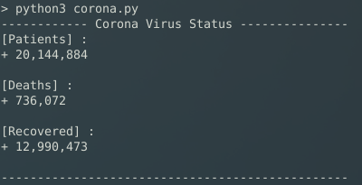

# Corona Virus Status in The WORLD ...

this script shows live information about corona virus in the world such as :
	- The Number Of Patients 
	- The Number Of Deaths
	- The Number Of Recovered

before start , install the bs4 library using pip so run :

```
$ pip3 install bs4
```

# SCREENSHOT : 




